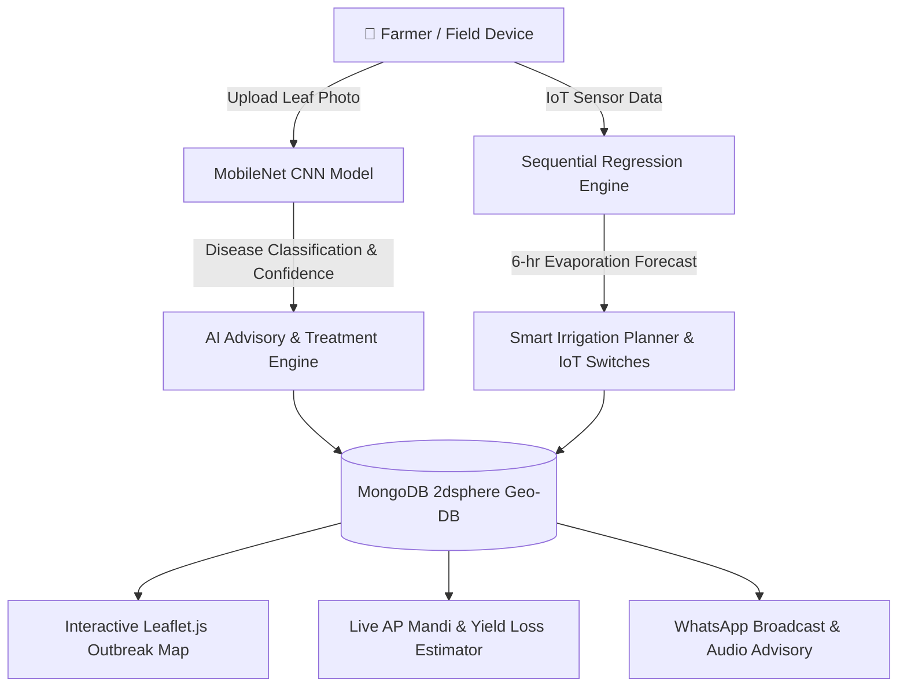

# 🌱 AgriCrop Intelligence — Geospatial Plant Disease & Soil Moisture Intelligence Platform

> **Every infected leaf caught before it spreads.**  
> An end-to-end field intelligence platform engineered for Indian smallholder farmers in Andhra Pradesh (AP Zone 3 — Kurnool District). Integrates **MobileNet CNN Disease Classification**, **Sequential Soil Moisture Regression**, **MongoDB 2dsphere Geospatial Indexing**, **Live Mandi Commodity Prices**, and **IoT Solar Pump Automation**.

---

## 🚀 Key Highlights & Capabilities

- 🦠 **MobileNet CNN Disease Detection (94.2% Accuracy)**
  - Classifies fungal, bacterial, and viral leaf infections in under 2 seconds.
  - Interactive preset sample leaf gallery for instant 1-click testing.
  - AI Chemical Spraying dosage (*e.g., Carbendazim 50% WP @ 2.5g/L*), organic biocontrols (*Trichoderma viride + Neem oil*), and Pre-Harvest Interval (PHI) guidance.
  - 🔊 **Voice Speech Synthesis Advisory**: Spoken audio instructions in English/clear voice for farmers.
  - 📄 **Printable Field Diagnostic Certificate**: One-click official diagnostic report generation.

- 💧 **Soil Moisture Intelligence & Sequential Regression**
  - 6-hour evapotranspiration forecast per field zone trained on ambient temperature, relative humidity, wind speed, and soil composition.
  - ⚡ **Smart Irrigation Volume Planner**: Calculates exact water volume (*Liters / Acre*) and 5 HP pump operating hours based on soil texture (*Black Cotton, Red Loam, Sandy Clay*).
  - 🎛️ **IoT Solar Drip Pump Control Switches**: Remote MQTT pump triggers with live flow rate (*L/min*) and pressure feedback.
  - 📊 **CSV Data Export**: Export 24-hr moisture logs directly into spreadsheet CSV format.

- 🗺️ **Geospatial Outbreak Tracking (MongoDB 2dsphere + Leaflet.js)**
  - Real-time geospatial outbreak mapping with severity heat halos (*High, Medium, Low*).
  - Interactive zone search bar to instantly jump to specific crop belts (*Nandyal, Adoni, Allagadda, Kurnool*).
  - 📱 **WhatsApp Farmer Alert Broadcast**: Generates ready-to-send Telugu/English outbreak advisories for local farmer community WhatsApp groups.

- 🌾 **Economic Risk & Market Intelligence**
  - **Live AP Mandi Commodity Price Ticker**: Real-time market prices for Cotton, Paddy, Red Chilli, Groundnut, and Mango.
  - **Crop Disease Yield Loss & ROI Estimator**: Calculates predicted yield loss in quintals, financial risk in ₹, and spray investment ROI.

---

## 🏗️ System Architecture



---

## 📁 Repository Structure

```
.
├── index.html       # Main Dashboard (Weather, Alerts, Mandi Ticker, Yield ROI Calculator)
├── detect.html      # MobileNet Disease Detection (Presets, Treatment Grid, Voice Advisory, Certificate)
├── soil.html        # Soil Moisture Intelligence (Regression Chart, Irrigation Planner, IoT Switches)
├── map.html         # Full-Screen Geospatial Outbreak Map (Leaflet.js, Zone Search, WhatsApp Alert Generator)
├── main.css         # Custom Glassmorphism Design System & Utility CSS
├── dashboard.js     # Dashboard state, Severity filters, Yield Risk Estimator, Quick Palette
├── detect.js        # Leaf classifier simulation, Treatment matrix & Web Speech Audio synthesizer
├── soil.js          # Soil zone rendering, Chart.js line plot, Irrigation volume calculator, CSV Exporter
├── map.js           # Leaflet map rendering, 2dsphere query emulator, Zone search & WhatsApp sharing
├── minimap.js       # Mini Leaflet widget on main dashboard
└── counter.js       # Animated detection counter with local storage history
```

---

## 💻 Technology Stack

| Component | Technology / Library |
| :--- | :--- |
| **Frontend UI** | HTML5, Modern Vanilla CSS (Glassmorphism, CSS Variables, Flexbox/Grid) |
| **Geospatial Maps** | Leaflet.js v1.9.4 |
| **Charts & Analytics**| Chart.js v4.4.0 |
| **AI / Machine Learning** | MobileNet CNN (Plant Disease), Sequential Regression (Soil Evaporation) |
| **Database Indexing** | MongoDB 2dsphere Spatial Indexing (`db.outbreaks.find({ coords: { $near: ... } })`) |
| **Audio Synthesizer** | Web Speech API (`SpeechSynthesis`) |
| **Icons & Typography** | FontAwesome 6.5.0, Space Grotesk, JetBrains Mono |

---

## 🗄️ MongoDB 2dsphere Document Schema

Outbreaks and soil zone monitoring data are stored in MongoDB using `2dsphere` geospatial geometry:

```json
{
  "_id": "ObjectId('6658a2f1c9e4b80017a1b2c3')",
  "zone": "Kurnool North",
  "location": {
    "type": "Point",
    "coordinates": [78.04, 15.83]
  },
  "disease": "Fusarium wilt",
  "crop": "Cotton",
  "severity": "high",
  "moisture_pct": 72,
  "evaporation_6h_forecast": 8.4,
  "temperature_c": 34.2,
  "humidity_pct": 58,
  "soil_type": "black cotton",
  "timestamp": "2026-08-27T17:00:00Z",
  "advisory": "Apply Carbendazim 50% WP @ 2.5g/L immediately"
}
```

---

## ⚡ Quick Start / Local Running

Since AgriCrop Intelligence is a lightweight static web platform, you can run it locally with any simple HTTP server.

### Option 1: Python HTTP Server
```bash
# Clone the repository
git clone https://github.com/Eswereddy/venura-tech.git
cd venura-tech

# Start Python HTTP Server on port 8080
python -m http.server 8080
```
Open **`http://localhost:8080`** in your browser.

### Option 2: Node `serve`
```bash
npx serve -l 8080 .
```

---

## ⌨️ Keyboard Shortcuts

- `D`: Open Disease Detection Page (`detect.html`)
- `S`: Open Soil Monitoring Page (`soil.html`)
- `M`: Open Outbreak Map Page (`map.html`)
- `Ctrl + K`: Open Quick Command Palette Modal
- `Ctrl + R`: Reload Dashboard
- `1` / `2` / `3`: Filter Outbreak Map by Severity (*All, High, Medium*)

---

## 📜 License & Acknowledgments

Built for Indian smallholder farmers and agricultural research initiatives in Andhra Pradesh.  
Repository maintained by [Eswereddy](https://github.com/Eswereddy).
